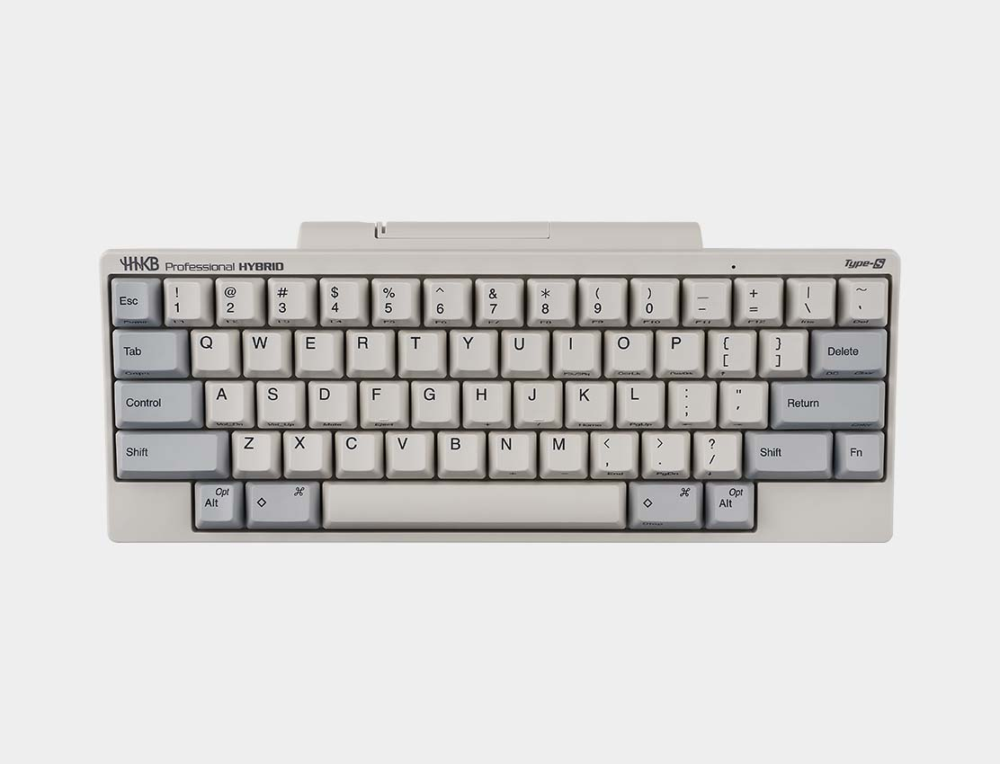
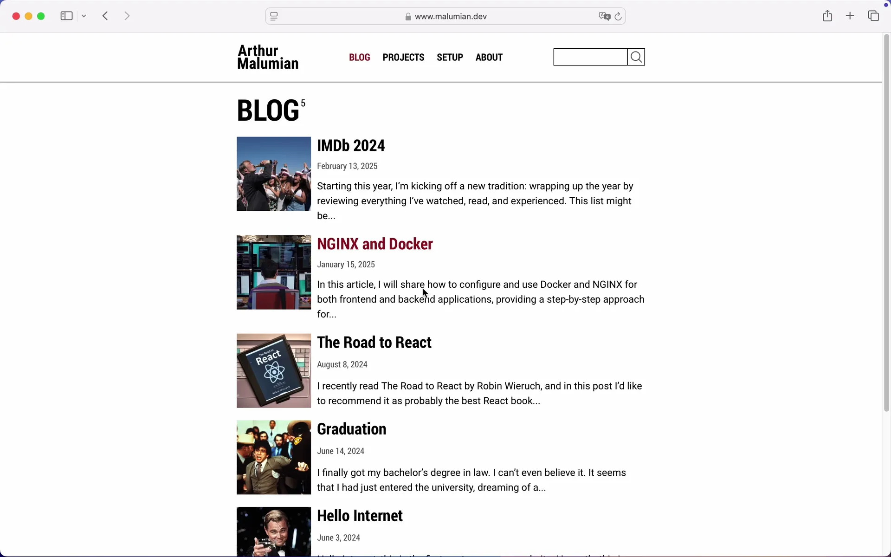
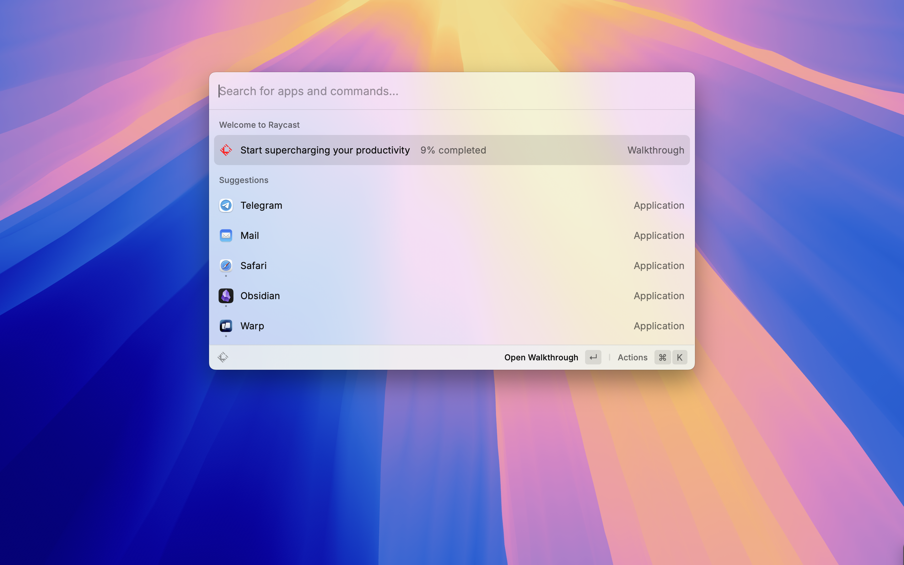
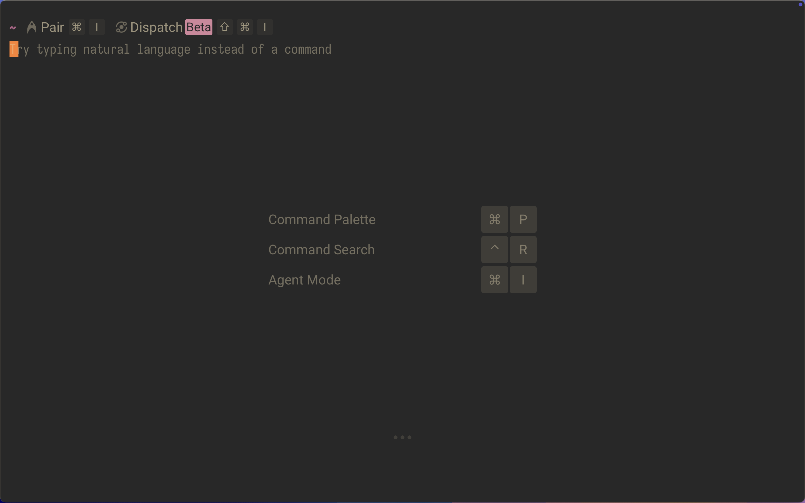
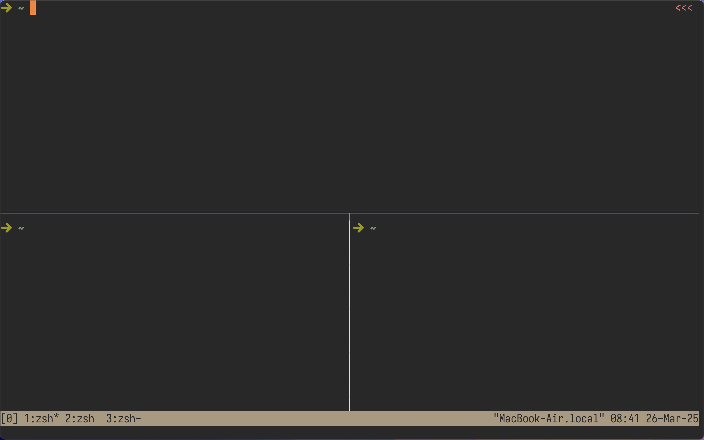
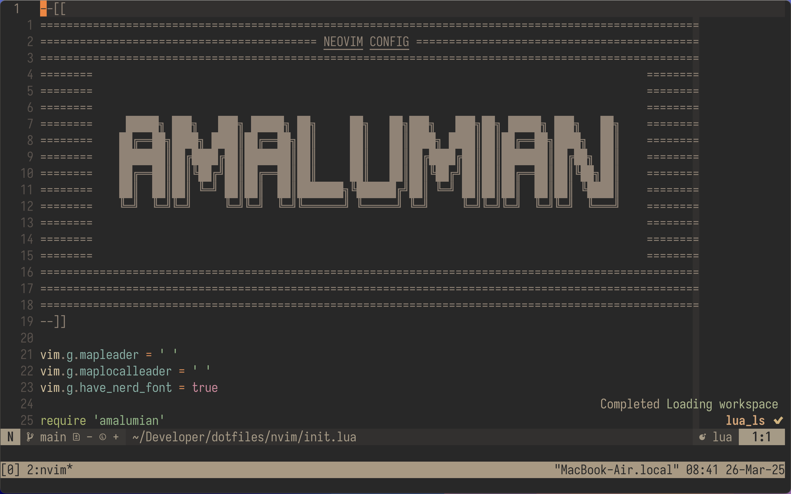
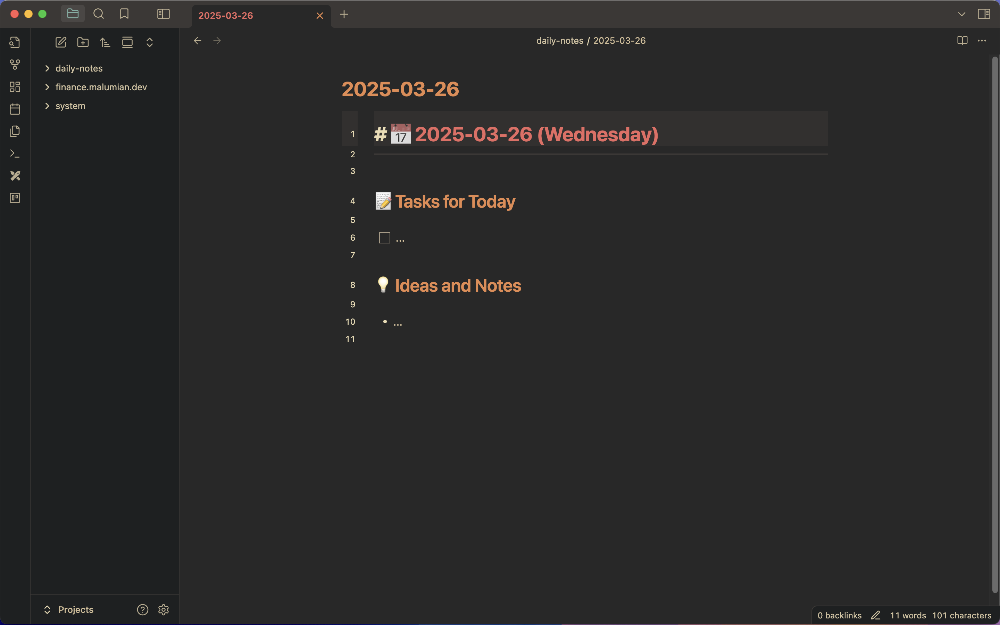

In this post, I'll share what I believe to be the most productive way to develop applications on macOS.

<!--more-->

## Prerequirements

The only essential requirement to achieve the same level of efficiency is touch typing. In my experience, you need to reach a typing speed of around 60 words per minute to feel completely comfortable.

There are many services to learn this skill, but my favorite — and the one I personally used — is [Ratatype](https://www.ratatype.com){:target="_blank"}.

Additionally, I highly recommend remapping `Caps Lock` to `Control`. You'll thank yourself later for doing this.

## Aerospace

[AeroSpace](https://github.com/nikitabobko/AeroSpace){:target="_blank"} is an i3-like tiling window manager for macOS. It's the best window manager I've found for macOS. It provides all the essential window management features while offering extensive customization options.

You get unlimited virtual desktops, seamless switching between them, moving applications to inactive desktops, changing focus between applications, rearranging applications on the screen, resizing windows, and more.

I also recommend changing the shortcuts to Vim-style `hjkl` for better efficiency.

An absolute must-have!

## Raycast

[Raycast](https://www.raycast.com){:target="_blank"} is the perfect replacement for the built-in Spotlight. It has enhanced capabilities, is incredibly fast, and even supports Vim-style keybindings.

## Warp

For my terminal, I use [Warp](https://www.warp.dev){:target="_blank"}. I previously used iTerm2, which is an excellent terminal, but Warp's AI-powered features won me over, so I switched to it.

## tmux

[tmux](https://github.com/tmux/tmux){:target="_blank"} is a terminal multiplexer. I assume it needs no introduction.

The only thing I'd recommend is changing the default window index from 0 to 1. Since keyboard number keys start at 1, it feels more intuitive. Also, I suggest remapping the pane navigation shortcuts to Vim-style `hjkl`. 

At the end of this post, you'll find a link to my config with these changes, or you can explore other solutions.

## Neovim

Vim is the best text editor, and [Neovim](https://github.com/neovim/neovim){:target="_blank"} is even better. Vim provides the most efficient and comfortable way to work with text.

With Neovim plugins, you can tailor your editor to your exact needs without unnecessary bloat. Modern code editors often have tons of features that don't provide real practical benefits.

If you want to get started with Vim, start by learning the basic Vim motions and setting up your own configuration. A good first step is installing a Vim plugin in your current code editor, whether it's WebStorm or VS Code  — it doesn't matter. Just get used to Vim motions. Once you get comfortable, start building your own Vim config and using the real Vim. I recommend [kickstart.nvim](https://github.com/nvim-lua/kickstart.nvim){:target="_blank"} for beginners. It has documentation for almost every line, helping you understand what each plugin or setting does. Later, you can tweak it or build your own setup from scratch.

If you don't want to bother with configuration at all, [LazyVim](https://www.lazyvim.org){:target="_blank"} is a great ready-to-go solution, but with this approach, you won't get too far from your favorite VS Code.

Also, check out Vim guides from ThePrimeagen — awesome guy!

## Obsidian

[Obsidian](https://obsidian.md){:target="_blank"} is a note-taking app where notes are stored as `md` files, making formatting familiar for developers.

There are multiple ways to sync notes across devices. You can store your vault in Git using a plugin (Obsidian has a vast plugin library). However, I prefer using iCloud for seamless access from my phone. You can also use Google Drive or OneDrive.

And yes, it supports Vim motions. As you can see, I use the same navigation model across all my tools, which is incredibly convenient.

## My Links

Other applications I use but didn't mention in this post can be found on the [Setup page](https://www.malumian.dev/setup/){:target="_blank"} of my website. You can also find my configuration files on [GitHub](https://github.com/amalumian/dotfiles){:target="_blank"}.
